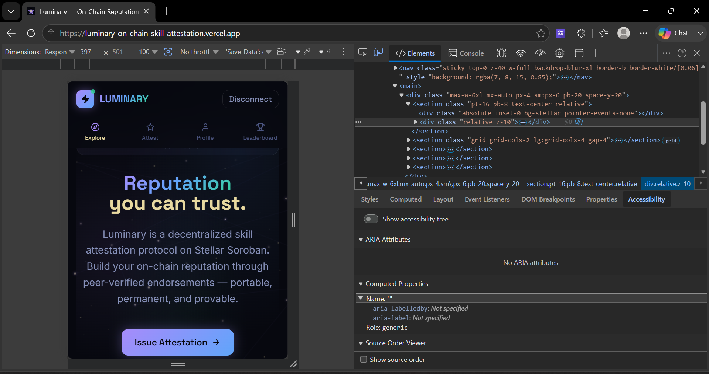
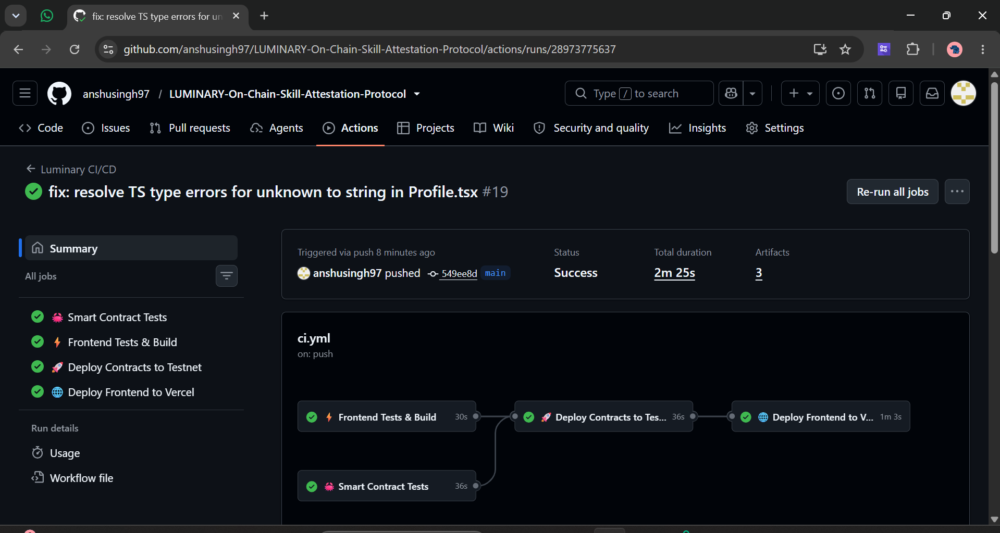
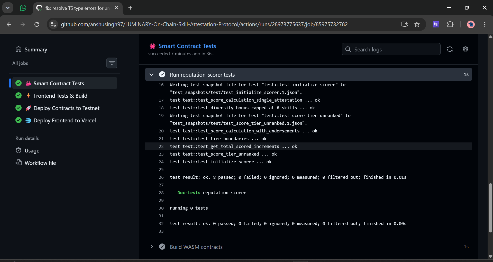

# 🌟 Luminary - On-Chain Skill Attestation Protocol

Luminary is a decentralized reputation and skill attestation platform built on Stellar (Soroban). It allows professionals to cryptographically verify each other's skills on the blockchain. Instead of relying on traditional, easily faked resumes, Luminary provides a permanent, public, and mathematically guaranteed proof of professional capabilities through peer-to-peer endorsements.

## 🚀 Live Demo & Video Pitch
- **Live Platform**: [luminary-on-chain-skill-attestation.vercel.app](https://luminary-on-chain-skill-attestation.vercel.app/)
- **Demo Video**: [Watch the Demo on Google Drive](https://drive.google.com/file/d/16NlEtQGzpF3EeyrNCCdTNOniTlqCOMyl/view?usp=sharing)

## 💎 Smart Contract Deployments (Testnet)
- **Attestation Registry Contract ID**: `CCBIDUNXHQG2ZLKYQ3WRPPQBOYK3KLGYJTKZQI6LLRFDSXU2VW25MYUG`
- **Reputation Scorer Contract ID**: `CCHSVXYKCYDQTP7MUTGNLIFREUPU7IVPLKCHGHKHLHXQKAQMPZ6JGJBL`

## ✨ Key Features

1. **On-Chain Attestations**: Verify and endorse the skills of your peers. Endorsements are permanently stored on the Stellar blockchain, ensuring data integrity and immutability.
2. **Dynamic Reputation Scoring**: The protocol uses a cross-contract `Reputation Scorer` to calculate the weight of each endorsement. An endorsement from a highly-rated "Master" carries more weight than one from an "Apprentice".
3. **Real Wallet Integration**: Full Freighter wallet connection with live balance tracking, utilizing the latest `@stellar/stellar-sdk` for cryptographic transaction signing on the Stellar Testnet (Protocol 22).
4. **Live Explore Feed**: Real-time indexing of the most recent attestations directly from Soroban without relying on a centralized database.
5. **Premium UI**: Built with React, Vite, and Vanilla CSS, featuring a stunning dark mode (Nova & Pulsar themes), custom typography, and highly responsive layouts.

---

## 📸 Platform Gallery & Submission Requirements

As per the submission checklist, here are the required screenshots demonstrating the platform's capabilities:

### 1. Mobile Responsive UI
The platform is fully responsive and optimized for mobile devices, offering a seamless experience across all screen sizes.


### 2. CI/CD Pipeline Running
Automated GitHub Actions workflow successfully running tests and deploying the frontend to Vercel.


### 3. Test Output (Passing Tests)
Comprehensive Rust integration tests validating the smart contract logic, attestation registry, and cross-contract reputation scoring.


---

## 🛠️ Technology Stack

- **Smart Contracts**: Rust, Stellar Soroban SDK
- **Frontend**: React, Vite, TypeScript, Vanilla CSS (for tailored design tokens and animations)
- **Blockchain Integration**: `@stellar/stellar-sdk` (v16+), `@stellar/freighter-api`
- **Deployment**: GitHub Actions, Vercel

## ⚙️ Getting Started Locally

### 1. Clone the repository
```bash
git clone https://github.com/anshusingh97/LUMINARY-On-Chain-Skill-Attestation-Protocol.git
cd LUMINARY-On-Chain-Skill-Attestation-Protocol
```

### 2. Install dependencies
```bash
cd frontend
npm install
```

### 3. Run the development server
```bash
npm run dev
```

### 4. Smart Contract Development
To run the contract tests locally:
```bash
cd ../contracts/attestation-registry
cargo test
```
